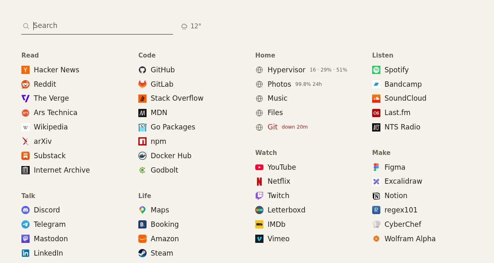
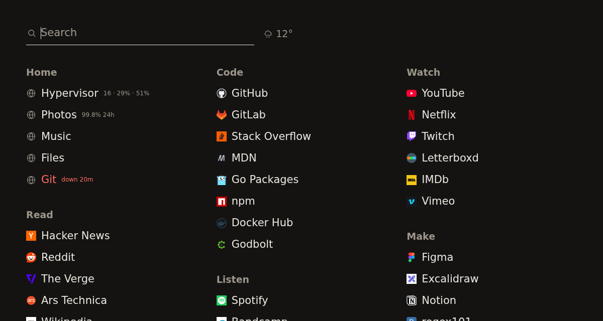

# newtab

The page your browser opens instead of its own new tab. Your links on one
screen, type to filter them, Enter opens the one you meant.


## Run it

```sh
go build ./cmd/newtab
./newtab demo                        # the page above, on made-up state

cp config.example.yaml config.yaml   # your links go here
./newtab validate config.yaml
./newtab run config.yaml
```

Icons are fetched from the sites themselves on the first run and read from disk
after that. A site that serves none gets the globe a browser would draw; a file
you put in `icon_dir` yourself wins over the fetcher.

## Config

```yaml
sections:
  - name: Read
    style: list
    links:
      - name: Hacker News
        url: https://news.ycombinator.com/
        alias: [hn]          # also matches when you type this
```

`style: list` is bookmarks; `style: live` is things that can be down, and those
rows can show state. Full example: [config.example.yaml](config.example.yaml).

## Looks

Colours, type size, columns and a background are config.

```yaml
theme:
  background: "#f6f3ec"
  ink: "#22201c"
  muted: "#6b6459"
  down: "#b3261e"
```



```yaml
theme:
  image: /var/lib/newtab/dusk.png
  image_dim: 0.55      # how much of it is shaded
```


```yaml
columns: 3
theme:
  font_size: 21
```



`newtab demo -config yours.yaml` renders your config against invented state —
how these were taken, and how to see a down row without waiting for one.

## Weather

```yaml
weather:
  latitude: 59.9386
  longitude: 30.3141
  every: 15m
```

Temperature and a glyph beside the field, from
[Open-Meteo](https://open-meteo.com/). No account, no key.

## Making it your start page

**Chrome, Edge, desktop.** Settings → On startup → Open a specific page, and
Appearance → Show home button → enter the address. That covers the button and
every launch; the new tab page itself can only be replaced by an extension, see
below.

**Firefox, desktop.** Settings → Home → Homepage and new windows → Custom URLs.
The New Tab setting there offers only Firefox Home or a blank page, so replacing
the new tab needs an extension in Firefox too.

**Android.** Chrome → Settings → Homepage → enter the address; the home button
then opens it. Or open the page and use ⋮ → Add to Home screen: it installs as
an app, full screen, with its own icon.

**iPhone.** Safari cannot be told to open a URL as its start page. Open the page
and use Share → Add to Home Screen — same result: an icon that opens it full
screen.

## As a new tab

Chrome and Firefox only let an extension replace the new tab page, so newtab
writes one:

```sh
./newtab extension config.yaml ./ext
```

A folder with the page, its icons and a manifest: load it unpacked
(`chrome://extensions` → Developer mode → Load unpacked, or `about:debugging`
in Firefox). It is a snapshot — no server, no network, no live state — so
rebuild it when your links change. Every
[release](https://github.com/eeegoloauq/newtab/releases) carries one built from
the example config.

Running the server instead keeps the page live.

## State from a monitor

```yaml
status:
  url: http://monitor.example/api/status
  every: 30s
  tail: problems
```

Rows match checks by the host they point at, or by `check:` on the link. A row
that is down says so and for how long. A healthy row shows whatever `tail` says:

| `tail` | a healthy row shows |
|---|---|
| `problems` (default) | nothing, until the last day was less than perfect — then `99.8% 24h` |
| `latency` | the last probe, `23 ms` |
| `uptime24h`, `uptime7d` | that figure, always |
| `never` | nothing, ever |

Written for [lookout](https://github.com/eeegoloauq/lookout), but it only reads
this much, so anything can serve it:

```json
{"version": 1, "checks": [
  {"name": "Photos", "url": "https://photos.example.com/", "status": "up",
   "muted": false, "last_probe": {"duration_ms": 21},
   "uptime_24h": {"ratio": 0.9982}, "incident": null}
]}
```

Nothing is written back, and the poll is on its own clock, so a monitor that is
slow or down costs the page nothing.

## Numbers from Proxmox

```yaml
proxmox:
  url: https://198.51.100.10:8006
  token_env: NEWTAB_PROXMOX_TOKEN   # user@realm!id=secret, from the environment
  attach: Hypervisor                # the link whose row shows them
  insecure: true                    # it answers with its own certificate
```

That row reads `16 · 29% · 51%` — guests running, cpu, memory — and hovering it
spells that out. `PVEAuditor` is enough. The secret is not in the config file.

## Notes

The page sends no referrer and loads nothing from anywhere but your own server.

Binaries: [releases](https://github.com/eeegoloauq/newtab/releases).
Systemd unit: [`contrib/systemd/newtab.service`](contrib/systemd/newtab.service).

MIT.
