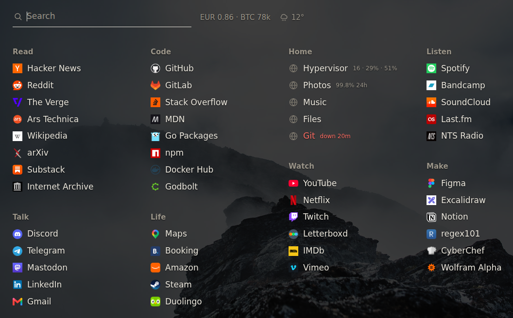

# newtab

The page your browser opens instead of its own new tab. Your links on one
screen, type to filter them, Enter opens the one you meant.


## Run it

```sh
go build ./cmd/newtab
./newtab demo                        # the page above, on made-up state

cp config.example.yaml config.yaml   # your links go here
./newtab validate config.yaml
./newtab run config.yaml
```

Icons are fetched from the sites themselves on the first run and read from disk
after that. A site that serves none gets the globe a browser would draw; a file
you put in `icon_dir` yourself wins over the fetcher.

## Config

```yaml
sections:
  - name: Read
    style: list
    links:
      - name: Hacker News
        url: https://news.ycombinator.com/
        alias: [hn]          # also matches when you type this
        pin: true            # first in its section
```

```yaml
search:
  engine: https://duckduckgo.com/?q=%s
  prefixes:                                  # "w cheese" goes to Wikipedia
    w: https://en.wikipedia.org/w/index.php?search=%s
    gh: https://github.com/search?q=%s
```

Anything that looks like an address — `example.com`, `198.51.100.20:5001` — opens
instead of being searched for.

`style: list` is bookmarks; `style: live` is things that can be down, and those
rows can show state. Full example: [config.example.yaml](config.example.yaml).

## Looks

Colours, type size, columns and a background image are config:

```yaml
columns: 4
theme:
  background: "#141312"     # any of these can be left out
  ink: "#e8e4da"
  muted: "#8a8478"
  font_size: 17
  image: /var/lib/newtab/hills.jpg
  image_dim: 0.75           # validate measures the picture and says if this is too low
```



`newtab demo -config yours.yaml` renders your config against invented state:
what a background does to it, and what a row looks like when something is down.

## Rates

```yaml
rates:
  base: USD
  fiat: [EUR, GBP]     # one USD in each
  crypto: [BTC, ETH]   # priced in USD
  every: 30m
```

`EUR 0.86 · BTC 78k` beside the field. Currencies from
[open.er-api.com](https://open.er-api.com/), crypto from Coinbase's public spot
price. Neither needs an account. TradingView has no free API — only an embedded
widget, which would mean somebody else's script on your page.

## Weather

```yaml
weather:
  latitude: 59.9386
  longitude: 30.3141
  every: 15m
```

Temperature and a glyph beside the field, from
[Open-Meteo](https://open-meteo.com/). No account, no key.

## Making it your start page

**Chrome, Edge, desktop.** Settings → On startup → Open a specific page, and
Appearance → Show home button → enter the address. That covers the button and
every launch; the new tab page itself can only be replaced by an extension, see
below.

**Firefox, desktop.** Settings → Home → Homepage and new windows → Custom URLs.
The New Tab setting there offers only Firefox Home or a blank page, so replacing
the new tab needs an extension in Firefox too.

**Android.** Chrome → Settings → Homepage → enter the address; the home button
then opens it. Or open the page and use ⋮ → Add to Home screen: it installs as
an app, full screen, with its own icon.

**iPhone.** Safari cannot be told to open a URL as its start page. Open the page
and use Share → Add to Home Screen — same result: an icon that opens it full
screen.

## As a new tab

Chrome and Firefox only let an extension replace the new tab page, so newtab
writes one:

```sh
./newtab extension config.yaml ./ext
```

A folder with the page, its icons and a manifest: load it unpacked
(`chrome://extensions` → Developer mode → Load unpacked, or `about:debugging`
in Firefox). It is a snapshot — no server, no network, no live state — so
rebuild it when your links change. Every
[release](https://github.com/eeegoloauq/newtab/releases) carries one built from
the example config.

Running the server instead keeps the page live.

## State from a monitor

This reads [lookout](https://github.com/eeegoloauq/lookout) — a small uptime
monitor of mine — and nothing else out of the box. Any other monitor works if
something serves lookout's document, which is the short JSON below; a script in
front of Uptime Kuma or Gatus is enough.

```yaml
status:
  url: http://monitor.example/api/status
  every: 30s
  tail: problems
```

Rows match checks by the host they point at, or by `check:` on the link. A row
that is down says so and for how long. A healthy row shows whatever `tail` says:

| `tail` | a healthy row shows |
|---|---|
| `problems` (default) | nothing, until the last day was less than perfect — then `99.8% 24h` |
| `latency` | the last probe, `23 ms` |
| `uptime24h`, `uptime7d` | that figure, always |
| `never` | nothing, ever |

The whole of what it reads:

```json
{"version": 1, "checks": [
  {"name": "Photos", "url": "https://photos.example.com/", "status": "up",
   "muted": false, "last_probe": {"duration_ms": 21},
   "uptime_24h": {"ratio": 0.9982}, "incident": null}
]}
```

Nothing is written back, and the poll is on its own clock, so a monitor that is
slow or down costs the page nothing.

## Numbers from Proxmox

```yaml
proxmox:
  url: https://198.51.100.10:8006
  token_env: NEWTAB_PROXMOX_TOKEN   # user@realm!id=secret, from the environment
  attach: Hypervisor                # the link whose row shows them
  insecure: true                    # it answers with its own certificate
```

That row reads `16 · 29% · 51%` — guests running, cpu, memory — and hovering it
spells that out. `PVEAuditor` is enough. The secret is not in the config file.

## On a server

Two files are the whole setup: your `config.yaml`, and either a compose file or
a systemd unit. Nothing is built here — every
[release](https://github.com/eeegoloauq/newtab/releases) carries binaries for
linux/amd64 and arm64, the browser extension, and `SHA256SUMS`.

**Docker.** The image is 23 MB, has no shell in it and runs as `nobody`. Put
[`contrib/compose.yaml`](contrib/compose.yaml) next to your config:

```sh
docker compose up -d
```

**Or the binary.**

```sh
install -m 0755 newtab-linux-amd64 /usr/bin/newtab
install -m 0644 contrib/systemd/newtab.service /etc/systemd/system/
mkdir -p /etc/newtab && cp config.yaml /etc/newtab/
newtab icons /etc/newtab/config.yaml     # fetch the site icons once
systemctl enable --now newtab
```

Then put a reverse proxy in front of it, or open the port to your LAN. Go is
only needed if you build it yourself.

To keep it current, [`contrib/newtab-update`](contrib/newtab-update) fetches the
latest release, checks it against `SHA256SUMS`, makes the new binary load your
config before replacing anything, and puts the old one back if the service does
not answer afterwards. Its timer is in `contrib/systemd/`.

## Notes

The page sends no referrer and loads nothing from anywhere but your own server.
There is no state to keep beyond the config and the icon directory.

MIT.
