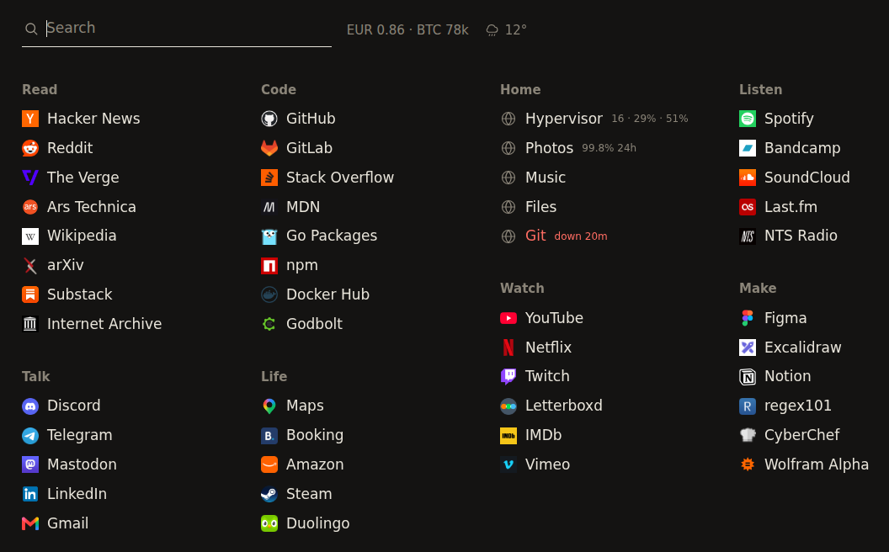

# newtab

A start page: everything you open on one screen, filtered as you type.



Type anywhere — the first keystroke lands in the field and the links narrow as
you go. Enter opens the first match, or searches the web with what you typed.
Arrows walk the matches, Escape clears. Links open in the tab you are in,
because that is the tab you opened to go somewhere.

Sections come in two kinds. `list` is plain bookmarks: icon, name. `live` is for
things that can be down, and those rows can carry state — how long something has
been down, or a number about it.

## Why it is a program and not a file

The page is static, and you can have it as a file: `newtab render -inline
config.yaml page.html` writes the whole thing, icons and all, into one HTML
document that works from disk. If links are all you want, stop there.

The program earns its place on the three things a file cannot do:

- fetch each site's own icon once and serve it from your own origin,
- read an uptime monitor and put what it says on the matching rows,
- read the Proxmox API, which needs a token that must never be inside a page
  the browser loads.

## Running it

```sh
go build ./cmd/newtab
./newtab demo                        # the page above, on invented state

cp config.example.yaml config.yaml   # then edit it
./newtab validate config.yaml
./newtab icons config.yaml           # fetch each site's icon
./newtab run config.yaml
```

```yaml
sections:
  - name: Read
    style: list
    links:
      - name: Hacker News
        url: https://news.ycombinator.com/
        alias: [hn]          # also matches when you type this
```

Icons come from the sites themselves, never through a favicon service: asking
one for forty icons hands it your list of links. A site that serves none gets
the globe a browser would draw, and a file you drop into `icon_dir` yourself
always beats the fetcher.

## State from a monitor

```yaml
status:
  url: http://monitor.example/api/status
  every: 30s
  tail: exceptions
```

Rows are matched to checks by the host they point at, or by `check:` on the
link. A row that is down says so and for how long. What a healthy row says is
`tail`: `exceptions` (the default — nothing, until the last day was less than
perfect), `latency`, `uptime24h`, `uptime7d` or `quiet`.

Written against [lookout](https://github.com/eeegoloauq/lookout), but the
document it reads is small enough to serve from anything:

```json
{"version": 1, "checks": [
  {"name": "Photos", "url": "https://photos.example.com/", "status": "up",
   "muted": false, "last_probe": {"duration_ms": 21},
   "uptime_24h": {"ratio": 0.9982}, "incident": null}
]}
```

The poll runs on its own clock and nothing is written back, so a monitor that is
slow or unreachable costs the page nothing: the rows go quiet, not blank.

## Numbers from Proxmox

```yaml
proxmox:
  url: https://198.51.100.10:8006
  token_env: NEWTAB_PROXMOX_TOKEN   # user@realm!id=secret, from the environment
  attach: Hypervisor                # the link whose row shows them
  insecure: true                    # it answers with its own certificate
```

That row then reads `16 · 29% · 51%` — guests running, cpu, memory — and hovering
it spells that out. A token holding `PVEAuditor` is enough, and the secret stays
out of the config file.

## Install

Binaries for linux/amd64 and arm64 are attached to each
[release](https://github.com/eeegoloauq/newtab/releases). There is no state to
keep beyond the config and the icon directory;
[`contrib/systemd/newtab.service`](contrib/systemd/newtab.service) is a hardened
unit to copy.

## License

MIT
